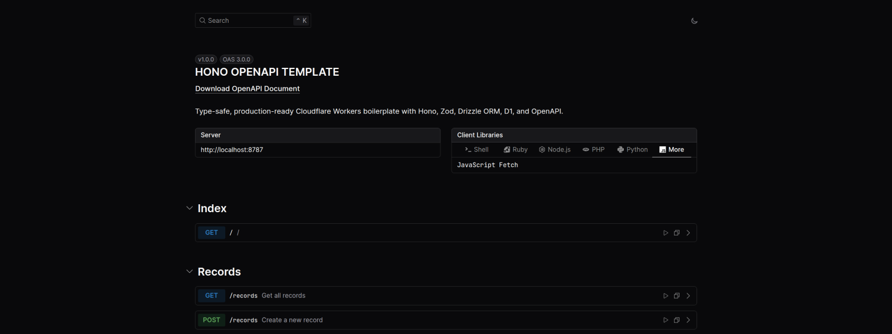

# Hono OpenAPI Template



Type-safe and production-ready Cloudflare Workers boilerplate with Hono framework, Zod validation, Drizzle ORM, D1 database, and OpenAPI docs.

## Features

- **Modern Stack**: Built with Hono, TypeScript, and Cloudflare Workers
- **Type Safety**: Full TypeScript support with Zod schema validation
- **API Documentation**: Auto-generated OpenAPI specs & Scalar UI
- **Database**: Drizzle ORM & Cloudflare D1 integration
- **Developer Experience**: Hot reload, linting, formatting, and git hooks

## Table of Contents

- [Tech Stack](#tech-stack)
- [Prerequisites](#prerequisites)
- [Installation](#installation)
- [Configuration](#configuration)
- [Development](#development)
- [Deployment](#deployment)
- [Available Scripts](#available-scripts)
- [Contributing](#contributing)
- [Acknowledgements](#acknowledgements)
- [License](#license)

## Tech Stack

| Component             | Technology                  |
| --------------------- | --------------------------- |
| **Runtime**           | Cloudflare Workers          |
| **Framework**         | Hono                        |
| **Language**          | TypeScript                  |
| **Validation**        | Zod                         |
| **Database**          | Drizzle ORM + Cloudflare D1 |
| **API Documentation** | OpenAPI + Scalar UI         |
| **Package Manager**   | pnpm                        |

## Prerequisites

Before getting started, ensure you have the following installed:

- **Node.js** 18.x or higher
- **pnpm** package manager
- **Cloudflare account** with Workers and D1 access

## Installation

1. **Clone and install dependencies:**

   ```bash
   git clone https://github.com/alwalxed/hono-openapi-template.git
   cd hono-openapi-template
   pnpm install
   ```

2. **Set up environment configuration:**

   ```bash
   cp .env.example .env
   ```

   Update the `.env` file with your specific configuration values.

## Configuration

### Database Setup

1. **Create a new D1 database:**

   ```bash
   npx wrangler d1 create demo
   ```

2. **Update configuration files:**

   Add the returned database ID to `wrangler.jsonc`:

   ```json
   {
     "database_id": "your-database-id-here"
   }
   ```

3. **Generate TypeScript definitions:**

   ```bash
   pnpm run cf-typegen
   ```

4. **Configure Drizzle:**

   Update `drizzle.config.ts` with your database ID.

### Environment Variables

Configure the following environment variables in your `.env` file:

| Variable                | Description                | Example              |
| ----------------------- | -------------------------- | -------------------- |
| `NODE_ENV`              | Application environment    | `development`        |
| `JWT_SECRET`            | JWT signing secret         | Generate with crypto |
| `LOG_LEVEL`             | Logging verbosity          | `debug`              |
| `CLOUDFLARE_ACCOUNT_ID` | Your Cloudflare account ID |                      |
| `CLOUDFLARE_D1_TOKEN`   | D1 database access token   |                      |

> **Security Note**: Generate a secure JWT secret using:
>
> ```bash
> node -e "console.log(require('crypto').randomBytes(32).toString('hex'))"
> ```

## Development

### Local Database Setup

1. **Initialize local database:**

   ```bash
   pnpm run db:reset:local
   pnpm run db:generate:local
   pnpm run db:migrate:local
   ```

2. **Configure local database path:**

   Find your SQLite database path:

   ```bash
   find ./.wrangler/state/v3/d1/miniflare-D1DatabaseObject -name "*.sqlite"
   ```

   Update `drizzle.local.config.ts` with the returned path.

3. **Seed the database:**

   ```bash
   pnpm run db:seed:local
   ```

### Start Development Server

```bash
pnpm run dev
```

The development server will start with hot reload enabled. Your API documentation will be available at the `/docs` endpoint.

### Optional: Git Hooks Setup

Enable automated code quality checks:

```bash
pnpm run prepare
```

Create `.husky/pre-commit`:

```bash
#!/usr/bin/env sh
NVM_DIR="${NVM_DIR:-$HOME/.nvm}"
[ -s "$NVM_DIR/nvm.sh" ] && \. "$NVM_DIR/nvm.sh"
npx lint-staged
```

## Deployment

### Production Environment Setup

Before deploying, configure your production environment variables:

```bash
npx wrangler secret put NODE_ENV
npx wrangler secret put JWT_SECRET
npx wrangler secret put LOG_LEVEL
npx wrangler secret put CLOUDFLARE_ACCOUNT_ID
npx wrangler secret put CLOUDFLARE_D1_TOKEN
```

### Deploy to Production

```bash
pnpm run deploy
```

This command will build and deploy your application to Cloudflare Workers with optimizations enabled.

## Available Scripts

### Development Commands

| Command           | Description                                |
| ----------------- | ------------------------------------------ |
| `pnpm dev`        | Start development server with hot reload   |
| `pnpm build`      | Build for production                       |
| `pnpm deploy`     | Deploy to Cloudflare Workers               |
| `pnpm cf-typegen` | Generate Cloudflare TypeScript definitions |

### Code Quality Commands

| Command             | Description                          |
| ------------------- | ------------------------------------ |
| `pnpm lint`         | Lint TypeScript and JavaScript files |
| `pnpm lint:fix`     | Automatically fix linting issues     |
| `pnpm format`       | Format code using Prettier           |
| `pnpm format:check` | Check code formatting                |
| `pnpm knip`         | Detect unused dependencies           |

### Database Management

#### Local Database Commands

| Command                      | Description                            |
| ---------------------------- | -------------------------------------- |
| `pnpm run db:generate:local` | Generate database migrations           |
| `pnpm run db:migrate:local`  | Apply migrations to local database     |
| `pnpm run db:seed:local`     | Seed local database with sample data   |
| `pnpm run db:dump:local`     | View all local database data           |
| `pnpm run db:reset:local`    | Reset and recreate local database      |
| `pnpm run db:studio:local`   | Open Drizzle Studio for local database |
| `pnpm run db:inspect:local`  | Inspect local database schema          |

#### Production Database Commands

| Command                    | Description                             |
| -------------------------- | --------------------------------------- |
| `pnpm run db:migrate:prod` | Apply migrations to production database |
| `pnpm run db:studio`       | Open Drizzle Studio for remote database |
| `pnpm run db:inspect:prod` | Inspect production database schema      |

## Contributing

Contributions are welcome! Please see [CONTRIBUTING.md](./CONTRIBUTING.md) for guidelines.

## License

This project is licensed under the [MIT](./LICENSE) License.
